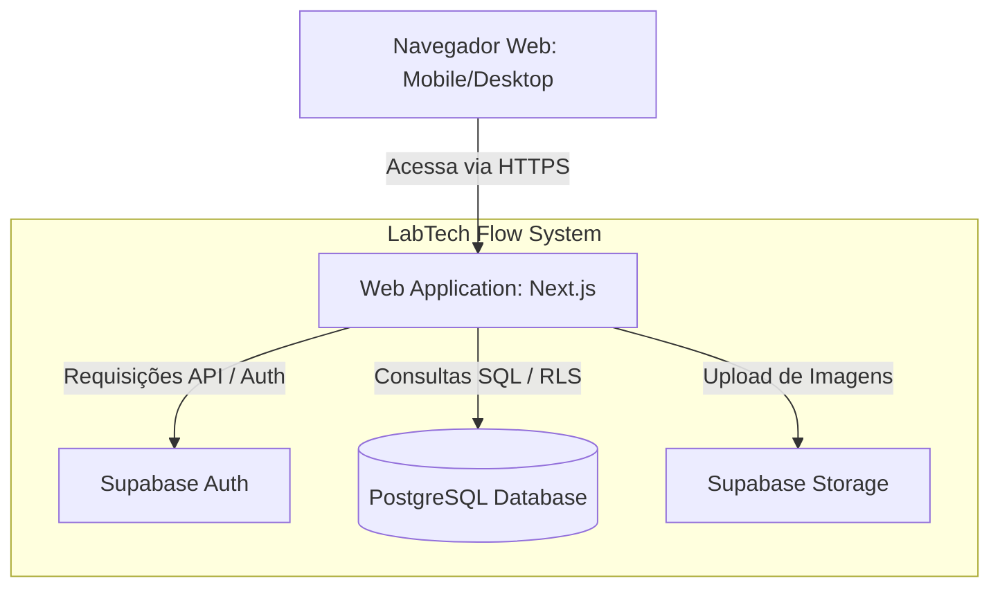

# C4 Model - Diagrama de Containers

Este diagrama detalha a estrutura interna do LabTech Flow, mostrando as responsabilidades de cada container tecnológico.

## Diagrama

## Descrição dos Containers
1. **Web Application (Next.js):** Responsável pela interface do usuário e lógica de servidor (API Routes). É onde reside a jornada do usuário.
2. **Supabase Auth:** Gerencia a segurança, tokens JWT e sessões de login dos perfis Solicitante e Técnico.
3. **PostgreSQL Database:** Armazena as tabelas de chamados, laboratórios, categorias e logs de atendimento.
4. **Supabase Storage:** Container responsável por armazenar as fotos anexadas nos chamados (requisito do MVP).

## Decisões de Tecnologia
* **Next.js:** Escolhido pela rapidez no desenvolvimento Front+Back integrado.
* **Supabase:** Escolhido para evitar a gestão manual de infraestrutura de servidor e banco.

---
**Elaborado por:** Arylson Simão Lopes, Davy Lopes da Cruz.
