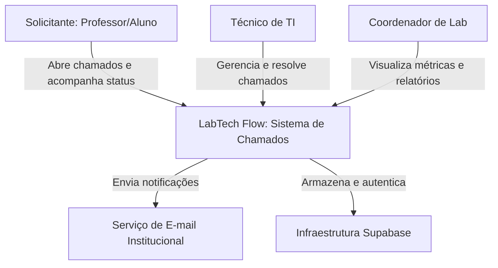

# C4 Model - Diagrama de Contexto

Este diagrama descreve o sistema LabTech Flow no nível mais alto, mostrando como ele interage com os usuários e sistemas externos.

## Diagrama
(Nota: Para a entrega final, você pode desenhar este diagrama no [Mermaid.live](https://mermaid.live/) ou [Draw.io] e anexar a imagem aqui).

## Descrição dos Elementos
1. **Solicitante:** Professores e alunos que precisam reportar problemas técnicos.
2. **Técnico de TI:** Membros da equipe de manutenção que atendem aos chamados.
3. **Coordenador:** Gestor que utiliza o sistema para tomada de decisão baseada em dados.
4. **LabTech Flow:** O sistema central desenvolvido para a UNIFACIMP.
5. **Serviço de E-mail:** Sistema externo para envio de alertas de novos chamados.
6. **Supabase:** Plataforma externa que fornece Banco de Dados e Autenticação.

---
**Elaborado por:** Arylson Simão Lopes, Davy Lopes da Cruz.
